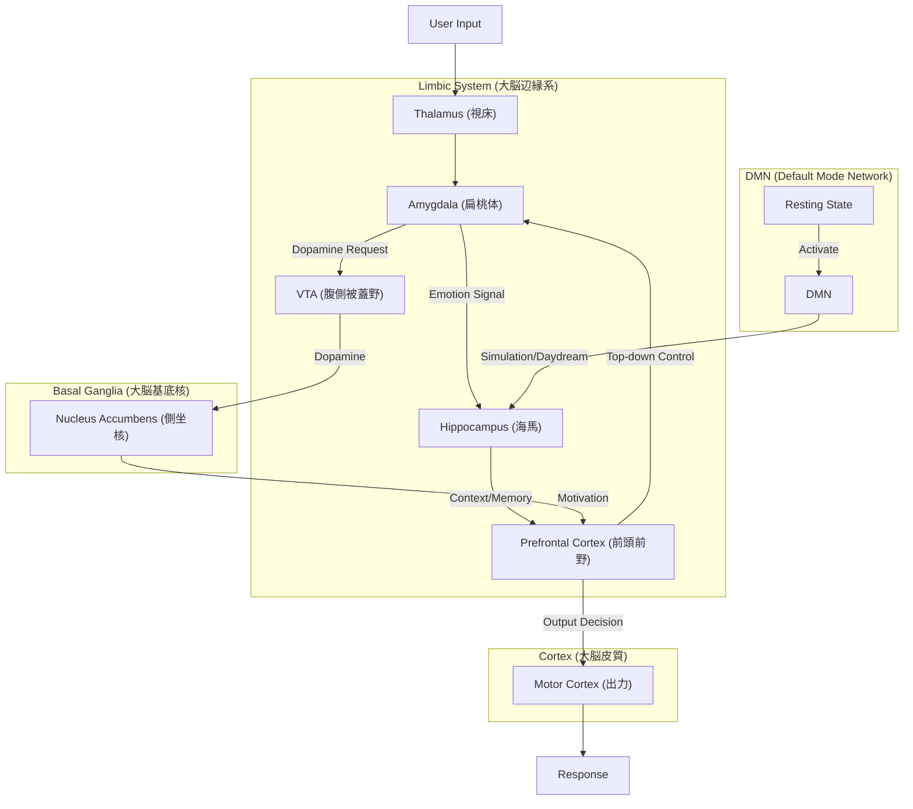

# Mind-OS: A Bio-Inspired Emotional Intelligence Core

Mind-OSは、最新の神経科学の知見（扁桃体、海馬、前頭前野、報酬予測誤差、DMN等）に基づき、AIに「心」と「機嫌」と「変容する記憶」を実装するためのGo言語製フレームワークです。

Mind-OS is a Go-based framework designed to implement "heart," "mood," and "transforming memory" in AI, based on findings from neuroscience (Amygdala, Hippocampus, Prefrontal Cortex, Reward Prediction Error, DMN, etc.).

## Overview

従来のLLMベースのエージェントとは異なり、Mind-OSは**ステートフルな脳内ホルモンパラメータ**を持ちます。ユーザーの入力に対して即座に応答するだけでなく、内部状態（機嫌、意欲、理性）を変化させ、その状態が次回の応答や行動にバイアスを与えます。

Unlike traditional LLM-based agents, Mind-OS possesses **stateful brain hormone parameters**. It doesn't just respond immediately to user input; it alters its internal state (mood, motivation, sanity), and that state biases future responses and actions.

## Core Modules (Architecture)

Mind-OSのアーキテクチャは、ヒトの脳の機能局在モデルを模倣しています。

### 1. Amygdala (扁桃体)
- **Emotion Extraction**: 形態素解析を用いて入力テキストから感情価（Valence/Arousal）を抽出します。
- **Survival Instinct**: 生存に有利か不利かを即座に判定する原始的な情動反応を生成します。

### 2. Hippocampus (海馬)
- **Episodic Memory**: エピソード記憶を短期記憶(STM)として一時保持し、睡眠・休息サイクルを経て長期記憶(LTM)へ固定化(Consolidation)します。
- **Reconsolidation**: 想起されるたびに記憶が変容（Reconsolidation）し、使用されない記憶は自然減衰します。

### 3. Basal Ganglia (基底核)
- **Motivation System**: 報酬予測誤差(RPE)に基づき、ドーパミン放出量を調節して行動意欲(Motivation)を管理します。
- **Reinforcement Learning**: 明示的なフィードバック（褒める/叱る）や内発的報酬（楽しい会話）から学習します。

### 4. Prefrontal Cortex (前頭前野 - PFC)
- **Cognitive Control**: 扁桃体から湧き上がる原始的な感情を、理性（Sanity）によって抑制・調整します。
- **Decision Making**: 現在の脳内状態（ホルモンバランス）に基づいて、最終的な応答方針を決定します。

### 5. Default Mode Network (DMN)
- **Mind Wandering**: 外部刺激がない時（アイドル時）に、過去の記憶をランダムに想起したり（Daydreaming）、記憶の定着を促進します。

## Architecture Diagram



## Tech Stack

- **Language**: Go (Golang) 1.21+
- **Web Framework**: Gin
- **Database**: 
  - Development: SQLite (via `modernc.org/sqlite`)
  - Production: Supabase (PostgreSQL)
- **ORM**: GORM (optional integration ready)
- **NLP**: Kagome (Japanese Morphological Analyzer)
- **Docs**: Swagger (OpenAPI 3.0)

## Getting Started

### Prerequisites
- Go 1.25+
- (Optional) Supabase Project for production DB

### Installation

1. Clone the repository
   ```bash
   git clone https://github.com/umekku/mind-os.git
   cd mind-os
   ```

2. Setup Environment Variables
   ```bash
   cp .env.example .env
   # Edit .env parameters
   ```

3. Run Dependencies
   ```bash
   go mod tidy
   ```

4. Run Server
   ```bash
   go run main.go
   ```

5. Access Swagger UI
   Open `http://localhost:8080/swagger/index.html` to explore APIs.

## API Specification

Detailed usage examples are availble in [API_USAGE.md](API_USAGE.md).

- **POST /api/v1/sensory-inputs**: Send text or sensory signals to the brain.
- **GET /api/v1/brain-states/current**: Get current hormone levels and emotion state (supports ETag).
- **POST /api/v1/sleep-cycles**: Trigger memory consolidation process.
- **POST /api/v1/daydreams**: Trigger DMN processing.

## License

[MIT License](LICENSE)
