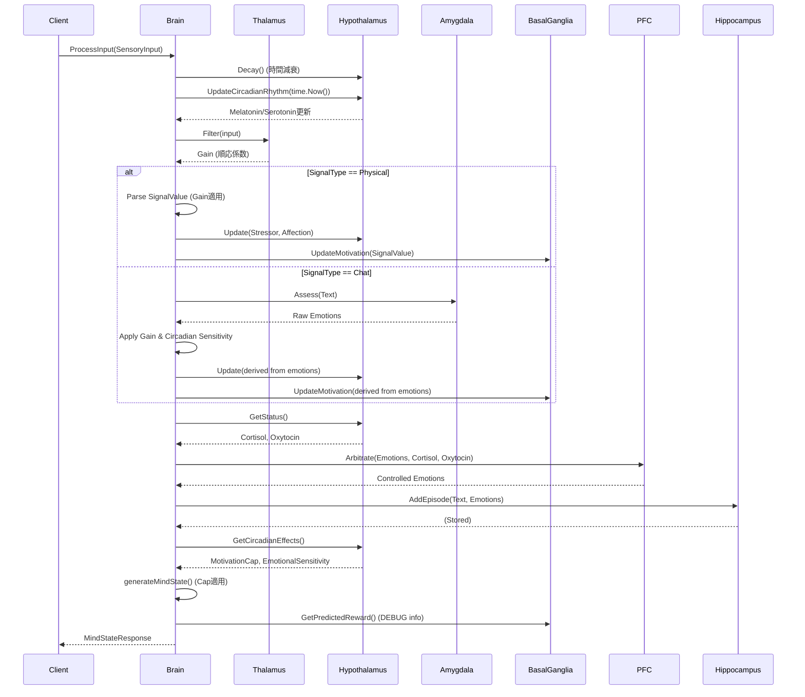

# Mind-OS 詳細設計書 (Detailed Design Document)

**Version:** 1.1.0  
**Target Spec:** v1.4.0  
**Last Updated:** 2026-01-20

## 1. モジュール詳細設計 (Module Design)

### 1.1 Thalamus (視床)
**パッケージ:** `internal/thalamus`

*   **責務**: 感覚入力のゲート制御と順応（慣れ）の管理。
*   **アルゴリズム**:
    1.  **類似度判定**: 現在の入力テキストと直前の入力を比較。
        *   完全一致または80%以上の部分一致で「同じ入力」と判定。
    2.  **繰り返しカウント**: 同じ入力が続く場合、`RepetitionCount` をインクリメント。
    3.  **ゲイン計算（順応）**:
        $$ \text{Gain} = \frac{1.0}{1.0 + 0.5 \times \text{RepetitionCount}} $$
        *   0回目: 1.0 (100%)
        *   1回目: 0.67 (67%)
        *   2回目: 0.5 (50%)
        *   3回目: 0.4 (40%)
*   **主なデータ構造**:
    ```go
    type Thalamus struct {
        LastInputText       string
        RepetitionCount     int
        SatiationLevel      float64 // 飽和度 (0.0-1.0)
        similarityThreshold float64
    }
    ```

### 1.2 Hypothalamus (視床下部)
**パッケージ:** `internal/hypothalamus`

*   **責務**: 恒常性 (Homeostasis) 変数の維持と概日リズム管理。
*   **ホルモンモデル**:
    *   **Cortisol / Oxytocin**: 刺激による変動と時間減衰。
    *   **Melatonin / Serotonin**: 時刻に基づく概日リズム。
*   **数理モデル**:
    *   **減衰 (Decay)**: 
        $$ V_{t+1} = V_t - (\Delta t \times \text{DecayRate}) $$
        *現状: 1時間あたり -10*
    *   **更新 (Update)**:
        $$ V_{stress} = \text{clamp}(V_{stress} + \text{Input}_{negative}, 0, 100) $$
        $$ V_{affection} = \text{clamp}(V_{affection} + \text{Input}_{positive}, 0, 100) $$
    *   **概日リズム (Circadian)**:
        *   **夜間 (22:00-6:00)**:
            $$ \text{Melatonin} = 50 + 50 \times \frac{\text{DayTimeStart} - \text{Hour}}{\text{DayTimeStart}} $$
            $$ \text{Serotonin} = 20 $$
        *   **日中 (6:00-22:00)**:
            $$ \text{Melatonin} = 10 $$
            $$ \text{Serotonin} = 60 + 40 \times \sin\left(\frac{\text{Hour} - 6}{16} \times \pi\right) $$
    *   **概日リズム効果**:
        *   意欲キャップ: $\text{Cap} = 1.0 - \frac{\text{Melatonin}}{200}$
        *   感情感度: $\text{Sensitivity} = 1.0 + \frac{\text{Melatonin}}{500}$
        *   ストレス減衰加速: $\text{Boost} = 1.0 + \frac{\text{Serotonin}}{100}$

### 1.3 Amygdala (扁桃体)
**パッケージ:** `internal/amygdala`

*   **責務**: 入力テキストからの原始的な感情抽出。
*   **アルゴリズム**:
    1.  **形態素解析**: `ikawaha/kagome` を使用してテキストを単語（トークン）に分解。
    2.  **辞書マッチング**:
        *   内部に `map[string]map[EmotionCode]int` 形式の辞書を保持。
        *   トークンごとに辞書を検索 (計算量: $O(N)$)。
    3.  **感情合成**:
        *   マッチした単語の感情値を単純加算。
        *   最終結果が100を超えた場合は100にクリッピング。
*   **主なデータ構造**:
    ```go
    type Amygdala struct {
        tokenizer *tokenizer.Tokenizer
        dict      map[string]map[models.EmotionCode]int
    }
    ```

### 1.4 Basal Ganglia (大脳基底核)
**パッケージ:** `internal/basal`

*   **責務**: 報酬予測誤差 (RPE) に基づく意欲の学習。
*   **数理モデル (RPE)**:
    1.  **予測誤差 (Prediction Error, $\delta$)**:
        $$ \delta = R_{actual} - V_{predicted} $$
    2.  **意欲更新 (Motivation Update)**:
        $$ M_{t+1} = M_t + \alpha \times \delta $$
        *   $\alpha$: 学習率 (0.5)
    3.  **期待値更新 (Value Update)**:
        $$ V_{t+1} = V_t + \beta \times \delta $$
        *   $\beta$: 学習率 (0.3)
    *   **挙動**: 期待値が実際の報酬に近づくにつれて $\delta$ が小さくなり、意欲の上昇（感動）が薄れる「慣れ」を再現。

### 1.5 Prefrontal Cortex (PFC, 前頭前皮質)
**パッケージ:** `internal/pfc`

*   **責務**: 理性とホルモンバランスに基づく感情のフィルタリング。
*   **制御ロジック (Arbitrate)**:
    1.  **抑制率 (Suppression Rate)**:
        $$ S = \frac{\text{Sanity}}{100.0} $$
    2.  **ストレス影響 (Cortisol > 50)**:
        *   抑制率の低下: $S' = S \times \left(1.0 - \frac{C - 50}{100}\right)$
        *   ネガティブ感情増幅: $E'_{ng} = E_{ng} \times \left(1.0 + \frac{C - 50}{100}\right)$
    3.  **愛着影響 (Oxytocin > 50)**:
        *   怒りの変換 (Anger -> Grief):
            *   確率 $P = \frac{O - 50}{100}$
            *   乱数 $r < P$ の場合、EmotionCodeを `G` (Grief) に変更。
    4.  **最終適用**:
        $$ E_{final} = E_{input} - (E_{input} \times S' \times 0.5) $$

### 1.6 Hippocampus (海馬)
**パッケージ:** `internal/hippocampus` / `internal/store`

*   **責務**: 記憶の永続化。
*   **スキーマ (SQLite)**:
    ```sql
    CREATE TABLE memories (
        uuid TEXT PRIMARY KEY,
        text TEXT,
        emotions TEXT, -- JSON structure
        weight REAL,
        type TEXT,     -- 'STM' or 'LTM'
        created_at DATETIME,
        last_access DATETIME,
        tags TEXT      -- JSON array
    );
    ```

## 2. 処理シーケンス (Processing Sequence)

`internal/core/Brain.ProcessInput` における処理フロー詳細:



## 3. ディレクトリ構造 (Project Structure)

```
mind-os/
├── cmd/                # エントリーポイント用 (未使用、main.goはルート)
├── internal/           # 内部パッケージ
│   ├── amygdala/       # 扁桃体
│   ├── basal/          # 大脳基底核
│   ├── config/         # 設定読み込み
│   ├── core/           # Brain本体、統合ロジック
│   ├── handlers/       # HTTPハンドラ
│   ├── hippocampus/    # 海馬
│   ├── hypothalamus/   # 視床下部 (homeostasis.go, bioclock.go)
│   ├── models/         # 共通型定義
│   ├── pfc/            # 前頭前皮質
│   ├── store/          # DBアクセス
│   └── thalamus/       # 視床 (NEW)
├── design/             # 設計ドキュメント (本ファイルなど)
├── docker-compose.yml
├── Dockerfile
├── go.mod
├── main.go             # エントリーポイント
├── README.md
├── SPEC.md             # システム仕様書
└── DESIGN.md           # 詳細設計書 (本ファイル)
```

## 4. 時間依存性とライフサイクル

### 4.1 概日リズムの時間帯別挙動

| 時間帯 | Melatonin | Serotonin | 意欲キャップ | 感情感度 | 効果 |
|:---|:---|:---|:---|:---|:---|
| 深夜 (0-2時) | 90-100 | 20 | 50-55% | 1.18-1.20x | 最も眠く感傷的 |
| 早朝 (6-8時) | 50-60 | 60-80 | 70-75% | 1.10-1.12x | 目覚め始め |
| 正午 (12時) | 10 | 100 | 95% | 1.02x | 最も活発 |
| 夕方 (18時) | 10 | 80 | 95% | 1.02x | まだ活動的 |
| 夜 (22時) | 80 | 60 | 60% | 1.16x | 眠気と感傷 |

### 4.2 繰り返し入力への順応

| 繰り返し回数 | Gain | 感情値への影響 | 例 |
|:---|:---|:---|:---|
| 0回目 (初回) | 1.0 | 100% | Joy 80 → 80 |
| 1回目 | 0.67 | 67% | Joy 80 → 53 |
| 2回目 | 0.5 | 50% | Joy 80 → 40 |
| 3回目 | 0.4 | 40% | Joy 80 → 32 |
| 5回目 | 0.29 | 29% | Joy 80 → 23 |
